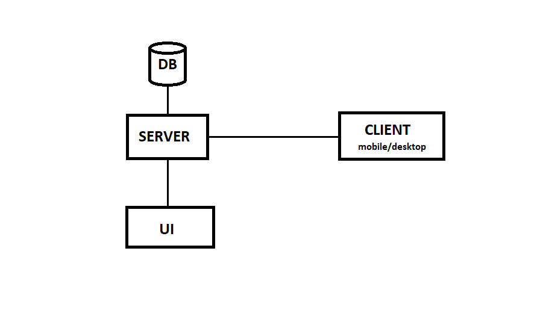

# Courier-application
Distributed application for tracking package deliveries

## Overview
This project is a distributed application designed to efficiently track package deliveries. It provides a robust and scalable system for managing packages and couriers, with a well-structured backend built on Spring Boot and a dynamic frontend developed using React. Additionally, a desktop client, developed in C# using Visual Studio, is designed for customers to track their orders.

## System Architecture
- **Frontend (Administrator Interface):** React-based user interface for managing and tracking package deliveries.
- **Backend:** Spring Boot application handling business logic and database operations.
- **Database:** MySQL database storing package and courier information.
- **Desktop Client (Customer Interface):** C# application allowing customers to track their orders and send inquiry emails.

## Features
### Backend
- **CRUD Operations:**
  - `Package`: Create, read, update, and delete package records.
  - `Courier`: Create, read, update, and delete courier records.
- **Custom Queries:**
  - `getAllCouriersWithoutPendingPackages()`: Retrieves couriers without any pending deliveries.
  - `getAllManagersAndDeliveredNumber()`: Retrieves all managers along with the number of packages they have delivered.

### Frontend (Administrator)
- **User Operations:**
  - Create a package.
  - View assigned packages.
  - View unassigned packages.
  - Assign package(s) to couriers.
  - Mark package as delivered.
  - Update package fields.
  - View delivery statuses.

### Desktop Client (Customer)
- **Customer Functions:**
  - Retrieve order status.
  - Send email inquiries regarding order status (implemented via SMTP in C#).

## Data Model
- **Package:**
  - `id`: Unique identifier.
  - `courier_id`: Assigned courier.
  - `created_on`: Timestamp of package creation.
  - `delivery_address`: Destination address.
  - `pay_on_delivery`: Boolean indicating payment status.
  - `status`: Possible values – NEW, PENDING, DELIVERED.
- **Courier:**
  - `id`: Unique identifier.
  - `name`: Courier's name.
  - `email`: Contact email.
  - `manager_id`: Supervisor (also a courier).

## Technology Stack
- **Frontend:** React
- **Backend:** Spring Boot (IntelliJ IDEA)
- **Database:** MySQL
- **Desktop Client:** C# (Visual Studio)
- **Email Service:** SMTP integration for customer inquiries

## Conclusion
This project provides a structured and scalable solution for managing package deliveries in a distributed environment. With its well-defined backend, user-friendly administrator frontend, and a customer-oriented desktop client, it offers a complete system for tracking and managing deliveries efficiently.

